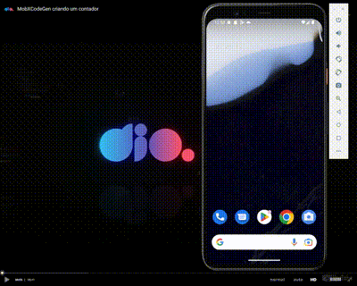

<!-- Logo -->

   

	
   

# :pushpin: Table of Contents

* [Technologies](#computer-technologies)
* [Found a bug? Missing a specific feature?](#bug-issues)
* [License](#closed_book-license)

### Mobile Screenshot

   

   

## :computer: 🚀 Technologies
This project was made using the follow technologies:

- ✔️ Dart

- ✔️ Flutter

# :bug: Issues

Feel free to **file a new issue** with a respective title and description on the the repository. If you already found a solution to your problem, **i would love to review your pull request**!

# :closed_book: License

Made with 💜 by [Robson Mendonça](https://github.com/robsonamendonca) 🚀.
This project is under the [MIT license](./LICENSE.txt).

Give a ⭐️ if this project helped you!